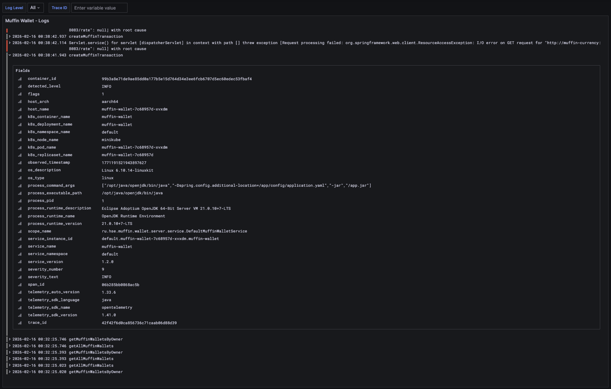
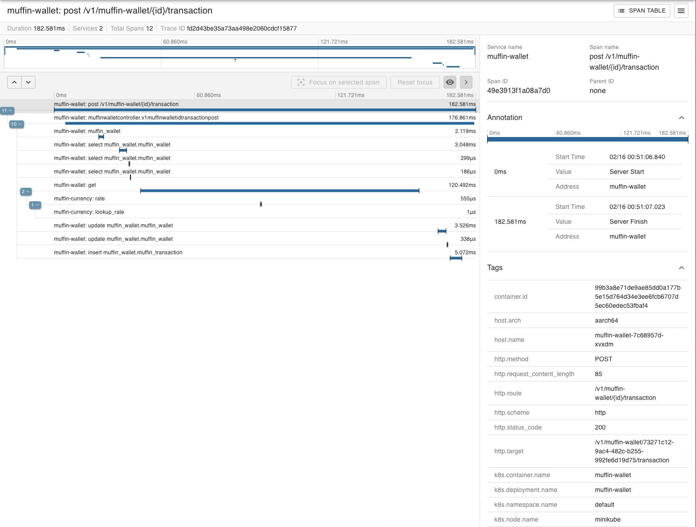

# Инструкция по развертыванию muffin-wallet и muffin-currency с Opentelemetry
### Выполнила Шиверских Елизавета Анатольевна БПИ223

**OpenTelemetry Collector** — это центральный компонент для сбора, обработки и экспорта телеметрии (метрик, логов, трейсов).

```
С Collector:
App → Collector → Prometheus
                → Loki
                → Zipkin
(1 соединение для приложения)
```

### Компоненты Collector:

1. **Receivers**: Принимают данные (OTLP, Prometheus, Jaeger и т.д.)
2. **Processors**: Обрабатывают данные (фильтрация, обогащение)
3. **Exporters**: Отправляют данные в бэкенды
4. **Connectors**: Связывают pipelines между собой
5. **Extensions**: Дополнительные возможности (health check, pprof)

---

## Компоненты системы

### 1. Приложения

#### muffin-wallet (Java/Spring Boot)
- **Язык**: Java 21
- **Фреймворк**: Spring Boot 3.x
- **База данных**: PostgreSQL
- **Инструментация**: OpenTelemetry Java Agent (auto-instrumentation)
- **Метрики**: 
  - JVM (memory, GC, threads)
  - HTTP requests (rate, latency, errors)
  - Database connections (HikariCP)
- **Endpoint**: `/actuator/prometheus`

#### muffin-currency (Go)
- **Язык**: Go
- **Инструментация**: OpenTelemetry Go SDK (manual)
- **Метрики**:
  - HTTP requests
  - Currency rates gauge
  - Process metrics
- **Endpoint**: `/metrics`

### 2. OpenTelemetry Stack

#### OpenTelemetry Operator
- **Версия**: Latest
- **Namespace**: monitoring
- **Функции**:
  - Управление Collector через CRD
  - Автоинструментация приложений
  - Injection Java agent в pods

#### OpenTelemetry Collector
- **Версия**: 0.85.0 (contrib)
- **Режим**: Deployment
- **Namespace**: default
- **Endpoints**:
  - OTLP gRPC: 4317
  - OTLP HTTP: 4318
  - Prometheus metrics: 8889

### 3. Backend сервисы

#### Prometheus (Metrics)
- **Версия**: 2.48.0
- **Хранение**: In-memory (демо)
- **Retention**: 15 days
- **Scrape interval**: 15s
- **Targets**:
  - otel-collector:8889
  - muffin-wallet:8080/actuator/prometheus
  - muffin-currency:8080/metrics

#### Loki (Logs)
- **Версия**: 3.6.1
- **Хранение**: PVC 5Gi
- **OTLP support**: Enabled
- **Retention**: 720h
- **Endpoints**:
  - HTTP: 3100
  - gRPC: 9096
  - OTLP: 3100/otlp

#### Zipkin (Traces)
- **Версия**: 2.24
- **Хранение**: In-memory
- **Endpoint**: 9411

### 4. Visualization

#### Grafana
- **Версия**: 10.2.3
- **Access**: NodePort 30300
- **Credentials**: admin/admin
- **Datasources**:
  - Prometheus (default)
  - Loki
  - Zipkin
- **Dashboards**:
  - Muffin Apps - Health Monitoring
  - Включает метрики и логи

### 5. Instrumentation (инструментация приложений)

**Instrumentation** - это процесс добавления кода для сбора телеметрии (метрик, логов, трейсов) из приложения. OpenTelemetry поддерживает два подхода: автоматическую и ручную инструментацию.

Автоматическое внедрение OpenTelemetry без изменения кода приложения работает через Java Agent - специальный jar-файл, который модифицирует байт-код приложения во время загрузки классов. Это добавлено в muffin-wallet

---

## Пошаговое развертывание


### Шаг 1: Подготовка кластера

```bash
minikube start --driver=docker
```

### Шаг 2: Установка cert-manager

OpenTelemetry Operator требует cert-manager для webhooks.

```bash
kubectl apply -f https://github.com/cert-manager/cert-manager/releases/download/v1.14.0/cert-manager.yaml
```

### Шаг 3: Установка OpenTelemetry Operator

```bash
helm repo add open-telemetry https://open-telemetry.github.io/opentelemetry-helm-charts
helm repo update

helm install opentelemetry-operator open-telemetry/opentelemetry-operator \
  --set "manager.collectorImage.repository=otel/opentelemetry-collector-contrib" \
  --set admissionWebhooks.certManager.enabled=true
```

### Шаг 4: Развертывание OpenTelemetry Collector и Instrumentation

```bash
kubectl apply -f otel-collector.yaml

# Автоматическое внедрение OpenTelemetry без изменения кода приложения. Работает через Java Agent - специальный jar-файл, который модифицирует байт-код приложения во время загрузки классов.
kubectl apply -f instrumentation.yaml
```

### Шаг 5: Развертывание backend сервисов

#### 5.1 Zipkin

```bash
kubectl apply -f zipkin.yaml
```

#### 5.2 Loki

```bash
kubectl apply -f loki.yaml
```

#### 5.3 Prometheus

```bash
kubectl apply -f prometheus.yaml
```

#### 5.4 Grafana

```bash
kubectl apply -f grafana.yaml
```

### Шаг 6: Развертывание приложений

#### 6.1 PostgreSQL (для muffin-wallet)

```bash
kubectl apply -f postgres.yaml
```

#### 6.2 Muffin Wallet

```bash
helm install muffin-wallet ./muffin-wallet
```

#### 6.3 Muffin Currency

```bash
helm install muffin-currency ./muffin-currency 
```

---

## Проверка работы

### 1. Проверка Prometheus

```bash
# Port-forward
kubectl port-forward svc/prometheus 9090:9090

# Откройте в браузере: http://localhost:9090
# Проверьте targets: http://localhost:9090/targets
# Должен быть активен otel-collector
```

### 2. Проверка Loki

```bash
# Port-forward
kubectl port-forward svc/loki 3100:3100

# Проверка labels
curl -s "http://localhost:3100/loki/api/v1/labels" | jq
```


### 3. Проверка Zipkin

```bash
# Port-forward
kubectl port-forward svc/zipkin 9411:9411

# Откройте в браузере: http://localhost:9411
# Выберите service: muffin-wallet или muffin-currency
# Нажмите "Run Query"
```



### 4. Проверка метрик приложений

```bash
# Wallet metrics
kubectl port-forward svc/muffin-wallet 8080:8080
curl http://localhost:8080/actuator/prometheus | grep http_server_requests

# Currency metrics
kubectl port-forward svc/muffin-currency 8080:8080
curl http://localhost:8080/metrics | grep http_requests
```

### 5. Генерация тестового трафика

```bash
# pod для генерации запросов
kubectl run traffic-gen --rm -i --image=curlimages/curl -- sh -c '
while true; do
  curl -s http://muffin-wallet.default.svc.cluster.local:8080/v1/muffin-wallets
  curl -s "http://muffin-currency.default.svc.cluster.local:8080/rate?from=CARAMEL&to=PLAIN"
  sleep 1
done
'
```

---

## Визуализация в Grafana

### Доступ к Grafana

```bash
kubectl port-forward svc/grafana 3000:3000
# Откройте: http://localhost:3000
```

**Credentials:**
- Username: `admin`
- Password: `admin`


---

## Детальное описание панелей дашборда

### 1. 📋 Logs Panel (Muffin Wallet - Logs)

**Расположение:** Верх дашборда, во всю ширину  
**Тип:** Logs
**Источник данных:** Loki

#### Что показывает:
Потоковые логи приложения muffin-wallet в реальном времени с возможностью фильтрации.
---

### 2. 📊 CPU Usage

**Расположение:** Слева, второй ряд  
**Тип:** Time series (линейный график)  
**Источник данных:** Prometheus

#### Что показывает:
Процент использования CPU процессом muffin-wallet относительно одного ядра.

---

### 3. 🚀 Request Rate - Currency

**Расположение:** Справа, второй ряд  
**Тип:** Time series (линейный график)  
**Источник данных:** Prometheus

#### Что показывает:
Количество HTTP запросов в секунду к muffin-currency сервису, с разбивкой по endpoint и status code.

#### Что показывают линии:

Каждая линия представляет уникальную комбинацию:
- **method**: HTTP метод (GET, POST, PUT, DELETE)
- **path**: endpoint (/rate, /health, /metrics)
- **status**: HTTP код (200, 404, 500)

---

### 4. 🗄️ DB Connections - Wallet

**Расположение:** Слева, третий ряд  
**Тип:** Time series (линейный график)  
**Источник данных:** Prometheus

#### Что показывает:
Состояние connection pool HikariCP для PostgreSQL базы данных.

#### Что означает каждая метрика:

**Active Connections:**
- Соединения, которые **сейчас используются** для выполнения SQL запросов
- Увеличивается при обработке запросов к БД
- Уменьшается когда запрос завершен и connection возвращен в pool

**Idle Connections:**
- Соединения, которые **готовы к использованию**, но сейчас свободны
- Connection pool держит минимум соединений всегда открытыми для быстрого доступа

**Max Connections:**
- Максимальное количество соединений в pool 
- Константа, настраивается в HikariCP config

---

### 5. 📈 Request Rate - Wallet

**Расположение:** Справа, третий ряд  
**Тип:** Time series (линейный график)  
**Источник данных:** Prometheus

#### Что показывает:
Количество HTTP запросов в секунду к muffin-wallet, с фильтрацией нулевых значений.

#### Особенность:
`> 0` в конце фильтрует метрики с нулевыми значениями, показывая только **активные endpoints**.

---

### 6. 🧠 JVM Memory - Wallet (G1 Old Gen)

**Расположение:** Слева, четвертый ряд  
**Тип:** Time series (линейный график)  
**Источник данных:** Prometheus

#### Что показывает:
Использование памяти в **Old Generation** heap (G1 Garbage Collector).
